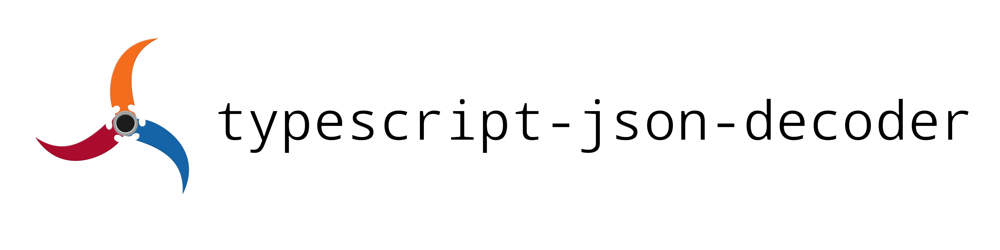

#

TypeScript Json Decoder is a library for decoding untrusted data as it comes in to your system, inspired by elm-json-decode.

Detecting at runtime that your type does not in fact match the value returned by your API sucks, and not being able to parse the data to a data structure of your liking in a convenient way sucks majorly - and having a type definition separate from its parser is unacceptable.

Installation: [npmjs.com/package/typescript-json-decoder](https://www.npmjs.com/package/typescript-json-decoder)

Try it here: [sandbox](https://codesandbox.io/s/typescript-json-decoder-playground-5751w5)

I've also written a piece about how it works internally and the underlying idea [here.](article.md)

## The idea

The following is an example of a simple decoder which defines a decoder of type `User`.

```typescript
import { decodeType, record, number, string, boolean } from 'typescript-json-decoder';

type User = decodeType<typeof userDecoder>;
const userDecoder = record({
    id: number,
    username: string,
    isBanned: boolean,
});
```

`userDecoder` is a function from any JavaScript object to `User`, which is the generated type. This type is inferred to be exactly what you expect. `number`, `string`, and `boolean` are also decoders in the same way, and decode values of their respective types. If any of these decoders fail they throw with an appropriate error message.

The idea is to have one declaration of the types in your system the same way as you would if you only used TypeScript, but also have decoders of those types. Although we declare decoders and infer the corresponding types, I like to think of the declaration as a normal type declaration like you are used to, and incidentally also getting a decoder.

To use this decoder with an endpoint which returns a user object, you would do the following.

```typescript
const user: Promise<User> =
    fetch('/users/1')
    .then(x => x.json())
    .then(userDecoder);
```

Although, the `Promise<User>` declaration is redundant; the correct type will be inferred for us. If the decoder fails, the promise is rejected.

## Benefits

- You have *one* definition of your type which is easy to change and mirrors regular TypeScript definitions. The decoder is a free bonus.

- Immediate error messages anytime your assumption about your API is wrong, or if it were to change in the future. No more runtime errors that only occasionally occur.

- If you use the decoder at the end of a fetch call, the promise will reject - meaning you can consider a decoding failure the same as any other network failure.

- A decoder for an object will pick out all the keys it needs, and discard the rest. This means that if your API has superfluous keys you don't care about, you won't carry unnecessary data around in the objects in your app.

- All the standard types have decoders provided which you can use directly and never have to write a custom decoder.

- If you'd like you can write custom decoders, operating on whatever data you want and producing whatever you want. Decoders are just functions, and functions can be composed!

- Decoders can do arbitrary transformations of your data, massaging it to have the exact shape and structure you want. There is no reason to be stuck with whatever data structure your API supplies.

- Decoders can do validation! If you want to write a decoder that does validation, simply pass the data through your decoder unchanged if it satisfies your rules, or throw an error if it doesn't.

## Usage

This library supports all the regular TypeScript types you are used to and can be composed arbitrarily to describe your types - with a goal of being as close to the regular type syntax as possible.

Expanding on the `User` example, we could for instance have an optional ssn and a list of phone numbers.

```typescript
import { decodeType, record, number, string, boolean, array, optional } from 'typescript-json-decoder';

type User = decodeType<typeof userDecoder>;
const userDecoder = record({
    id: number,
    username: string,
    isBanned: boolean,
    phoneNumbers: array(string),
    ssn: optional(string),
});
```

I call these higher order decoders, as they are functions accepting any decoder and returning the matching decoder. If you provide a function from any JavaScript object to a type `T`, that is a decoder of T (`Decoder<T>`) and can be used in any combination with each other.

Another useful kind of "type combinator" in TypeScript is the concept of a union of two types, for instance written `string | number` for the union of strings and numbers. We can imagine a user has a credit card number which is either a string or a number. Don't refer to me for domain modeling advice.

```typescript
import { decodeType, record, number, string, boolean, array, optional, union } from 'typescript-json-decoder';

type User = decodeType<typeof userDecoder>;
const userDecoder = record({
    id: number,
    username: string,
    isBanned: boolean,
    phoneNumbers: array(string),
    ssn: optional(string),
    creditCardNumber: union(string, number),
});
```

Union takes an arbitrary number of parameters.

Similarly, you can use something like `intersection({email: string}, userDecoder)` to get a decoder for `{email: string} & user`, the subtype of users that also have an e-mail address.

Lastly we can add some more stuff, and if you wish to fetch a list of your users, do it like the following.

```typescript
import { decodeType, record, number, string, boolean, array, optional, union } from 'typescript-json-decoder';

type User = decodeType<typeof userDecoder>;
const userDecoder = record({
    id: number,
    username: string,
    isBanned: boolean,
    phoneNumbers: array(string),
    ssn: optional(string),
    creditCardNumber: union(string, number),
    address: {
        city: string,
        timezones: array({ info: string, optionalInfo: optional(array(number)) })
    }
});

const users: Promise<User[]> =
    fetch('/users')
    .then(x => x.json())
    .then(array(userDecoder))
```

## Advanced usage

Everything so far should cover most APIs you need to model. However, I really want to give you the tools to model any kind of API you come across or want to create. Therefore we will look at some more complicated and useful constructs.

Although not as common in Json APIs (yet?), tuples are a very useful data structure. In JavaScript we usually encode them as lists with exactly two elements and possibly of different types, and TypeScript understands this. A tuple with a string and a number (such as `['user', 2]`) can be expressed with the type `[string, number]`. In this library we can use the `tuple` function to the same effect.

```typescript
import { decodeType, tuple, string, number } from 'typescript-json-decoder';

type StringAndNumber = decodeType<typeof stringAndNumberDecoder>;
const stringAndNumberDecoder = tuple(string, number);
const myTuple = stringAndNumberDecoder(['user', 2]);
```

This doesn't really match the syntax of regular TypeScript as much as I would like, so as a convenience feature we also allow a *literal syntax* for tuples. The idea is that a two element list of decoders can be cansidered itself a decoder of the corresponding tuple. The same example as above written in the literal form would be as follows.

```typescript
import { decodeType, decode, string, number } from 'typescript-json-decoder';

type StringAndNumber = decodeType<typeof stringAndNumberDecoder>;
const stringAndNumberDecoder = decode([string, number]);
const myTuple = stringAndNumberDecoder(['user', 2]);
```

Notice we now need a call to a `decode` function to make it into an actually callable decoder. `decode` is the low level implementation which all the other decoders are implemented in terms of; that is `record`, `tuple`, and all the other built in decoders eventually call `decode` to do the dirty work. But that's a tangent, the advantage to this approach is that you can use the literal tuple syntax directly in an object, such as the following.

```typescript
const myDecoder = record({
    username: string,
    result: [string, number],
    results: array([string, number]),
});
```

It turns out this idea of literal form decoders is actually a lot more general. In fact, you can consider the first example of the `User` type to be a literal decoder where the `User` decoder object is a decoder of a JavaScript object of the same form. For this reason we also consider strings as literal decoders of themselves, that is `decoder('hey')` literally decodes the string `'hey'`. That might seem dumb, but it allows some really cool stuff. Firstly it allows us to decode an object which looks exactly like the following.

```typescript
const x = { type: 'cool', somestuff: "" };
```

With this decoder.

```typescript
import { decodeType, decode, record, string } from 'typescript-json-decoder';

type Cool = decodeType<typeof coolDecoder>;
const coolDecoder = record({ type: decode('cool'), somestuff: string });
```

Similarly we can define another decoder of this type.

```typescript
const y = { type: 'dumb', otherstuff: 'starbucks' };
```

With a decoder that looks like this.

```typescript
import { decodeType, decode, record, string } from 'typescript-json-decoder';

type Dumb = decodeType<typeof dumbDecoder>;
const dumbDecoder = record({ type: decode('dumb'), otherstuff: string });
```

This ensures that the `type` key is exactly the string `cool` or `dumb` respectively. If we now combine these decoders using a union we get what is known as a "discriminated union".

```typescript
import { decodeType, union } from 'typescript-json-decoder';

type Stuff = decodeType<typeof stuffDecoder>;
const stuffDecoder = union(coolDecoder, dumbDecoder);
```

The type `Stuff` represents the union of these two other types, and TypeScript now requires us to check the `type` field before trying to access either `somestuff` or `otherstuff` since they do not appear in both types - but one of them are guaranteed to exist.

## Custom decoders

All the decoders we have defined so far are in a way custom decoders and can be combined freely, however I encourage people to create arbitrary parsing functions which transform and validate data. Simply create a function which tries to build the data structure you want and throw an error message if you are unable to signify failure. Decoders can be reused and combined however you want, and composition of decoders is simply function composition.

Here are some decoders I wrote mostly for fun.

`date` is a decoder which returns a native `Date` object. This is actually more expressive than what you usually get from a Json API typed with TypeScript, which might have the following type.

```typescript
type BlogPost = {
    title: string;
    content: string;
    createdDate: string;
}
```

However we know that `createdDate` is a string representing a date, and at some point we might or might not like to work with it as a `Date` object. Here I simply invoke the regular `string` decoder and then try to parse that string as a `Date`, and throw otherwise. That might look like the following.

```typescript
import { string } from 'typescript-json-decoder';

const date = (value: Pojo) => {
  const dateString = string(value);
  const timeStampSinceEpoch = Date.parse(dateString);
  if (isNaN(timeStampSinceEpoch)) {
    throw `String \`${dateString}\` is not a valid date string`;
  }
  return new Date(timeStampSinceEpoch);
};
```

I provide this decoder with the library, and we can use it as follows.

```typescript
import { decodeType, record, date } from 'typescript-json-decoder';

type blogpost = decodeType<typeof blogpostdecoder>;
const blogpostdecoder = record({
    title: string,
    content: string,
    createddate: date,
});
```

Look at that: actual, type safe, automatic parsing of a date encoded as a Json string.

At his point I went a little crazy implementing fun data structures. How about a dictionary? A dictionary is a map from strings to your type `T`, that is, the type `Map<string, T>`. The function `dict` then takes a decoder of `T` and creates a decoder which parses *JavaScript object literals* as maps. Take a look at the following example to understand how it works.

```typescript
import { dict } from 'typescript-json-decoder';

const myDictionary = {
    one: 1,
    two: 2,
    three: 3,
};

const numberDictionaryDecoder = dict(number);
const myMap = numberDictionaryDecoder(myDictionary); // Map<string, number>
console.log(myMap.get('two')); // 2
```

Although this makes a lot of sense, few APIs actually use Json literals to encode maps. Rather you often see lists of objects, for example lists of `User` objects, which in a sense *are* maps, and maybe you want to treat those as maps from their user id to the user object. Enter the `map` decoder.

The `map` decoder is a function which takes a decoder and a "key" function. The key function takes the decoded object and returns its key. Imagine you have Json of the following form.

```json
[
    {
        "id": 1,
        "username": "Fred",
        "isBanned": true,
    },
    {
        "id": 2,
        "username": "Olga",
        "isBanned": false,
    }
]
```

A decoder which understands this is data structure can be specified as the following.

```typescript
import { map, Decoder } from 'typescript-json-decoder';

const userListDecoder: Decoder<Map<number, User>> =
    map(userDecoder, x => x.id);
```

Here too the type declaration is redundant and will be inferred if you wish. You can also inline the definition if it only appears one place and you don't need a name for it.

```typescript
import { number, string, boolean, map, Decoder } from 'typescript-json-decoder';

const userListDecoder =
    map({
        id: number,
        username: string,
        isBanned: boolean,
    }, x => x.id);
```

## Low level access

Sometimes you need direct access to the fields of the object you're decoding. Maybe you want to use the same fields to calculate two different things, or maybe you want to combine two or more different fields.

The `field` decoder accepts a string, the name of the key, and a decoder which decodes the value found at this key.

Say you have some date in an iso-date-string format in the field `"dateOfBirth"` but are only interested in the year and month, you could use the `field` decoder to access it in the following way.

```typescript
import { decodeType, record, field } from 'typescript-json-decoder';

type User = decodeType<typeof userDecoder>;
const userDecoder = record({
    month: field('dateOfBirth', x => date(x).getMonth() + 1),
    year: field('dateOfBirth', x => date(x).getFullYear()),
});
```

Alternatively if you need both username and id you can use the `fields` decoder. This has a slightly different api. The `fields` decoder accepts an object decoder in the same way `decoder` does, and a second argument, a continuation, which accepts the result of this decoder and produces the resulting value of the `fields` decoder. An example is maybe more explanatory.

```typescript
import { decodeType, record, fields } from 'typescript-json-decoder';

type User = decodeType<typeof userDecoder>;
const userDecoder = record({
    identifier: fields({ username: string, userId: number },
                            ({ username, userId }) => `user:${username}:${userid}`),
});
```

This is read as "the `userDecoder` decodes an object which might look like `{ username: "hunter2", userId: 3 }` and decodes to an object which looks like `{ identifier: "user:hunter2:3" }`".

Both the `field` and the `fields` decoder are meant to be used "inside" a record decoder in the way shown here.
